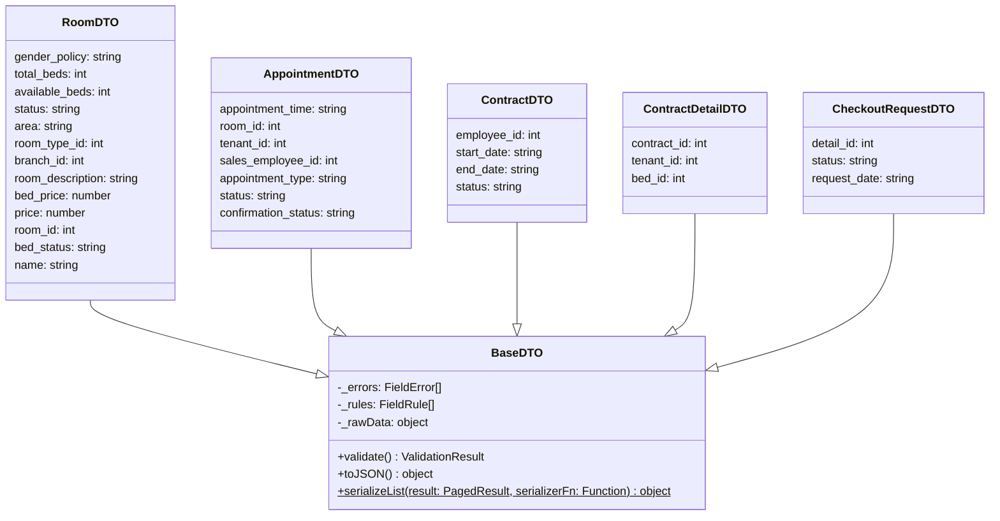
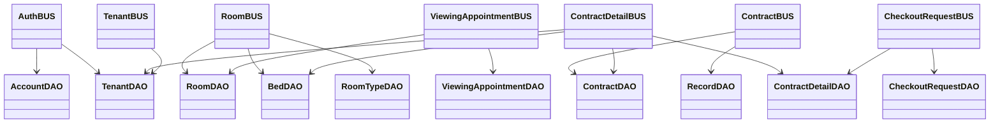

# HomeStay-Dorm — Class Diagram (Full)

> Ký hiệu: `+` public, `-` private, `#` protected

---

## 0. ENTITY LAYER (Domain Model — ánh xạ từ DB)

```mermaid
classDiagram

    class Branch {
        +branch_id: int
        +name: string
        +address: string
        +phone_number: string
        +email: string
    }

    class RoomType {
        +room_type_id: int
        +name: string
    }

    class Room {
        +room_id: int
        +room_number: int
        +gender_policy: string
        +total_beds: int
        +available_beds: int
        +room_description: string
        +status: string
        +area: string
        +room_images: string[]
        +room_type_id: int
        +branch_id: int
    }

    class Bed {
        +bed_id: int
        +status: string
        +price: decimal
        +room_id: int
    }

    class Employee {
        +employee_id: int
        +name: string
        +role: string
        +branch_id: int
    }

    class Tenant {
        +tenant_id: int
        +name: string
        +phone: string
        +gender: string
        +cccd_number: string
        +nationality: string
    }

    class ViewingAppointment {
        +appointment_id: int
        +appointment_time: timestamptz
        +status: string
        +confirmation_status: string
        +appointment_type: string
        +room_id: int
        +tenant_id: int
        +sales_employee_id: int
        +created_at: timestamptz
    }

    class Account {
        +account_id: int
        +username: string
        +email: string
        +password_hash: string
        +role: string
        +is_active: boolean
        +tenant_id: int
        +employee_id: int
        +created_at: timestamptz
    }

    class Contract {
        +contract_id: int
        +employee_id: int
        +start_date: date
        +end_date: date
        +status: string
        +created_at: timestamptz
    }

    class ContractDetail {
        +detail_id: int
        +contract_id: int
        +tenant_id: int
        +bed_id: int
    }

    class Record {
        +record_id: int
        +contract_id: int
        +type: string
        +note: string
        +created_at: timestamptz
    }

    class CheckoutRequest {
        +request_id: int
        +detail_id: int
        +status: string
        +request_date: timestamptz
        +processed_by: int
        +processed_at: timestamptz
    }

    Branch "1" --o{ "nhiều" Room : chứa
    Branch "1" --o{ "nhiều" Employee : có
    RoomType "1" --o{ "nhiều" Room : phân loại
    Room "1" --o{ "nhiều" Bed : gồm
    Room "1" --o{ "nhiều" ViewingAppointment : đặt lịch
    Tenant "1" --o{ "nhiều" ViewingAppointment : tạo
    Employee "0..1" --o{ "nhiều" ViewingAppointment : phụ trách
    Tenant "0..1" -- "0..1" Account : liên kết
    Employee "0..1" -- "0..1" Account : liên kết
    Employee "1" --o{ "nhiều" Contract : lập
    Contract "1" --o{ "nhiều" ContractDetail : gồm
    ContractDetail }o--|| Tenant : khách thuê
    ContractDetail }o--|| Bed : giường thuê
    Contract "1" --o{ "nhiều" Record : ghi nhận
    ContractDetail "1" --o{ "nhiều" CheckoutRequest : yêu cầu trả
```

---

## 1. BUS LAYER (Business Logic)

```mermaid
classDiagram

    class AuthBUS {
        +login(email: string, password: string) TokenUser
        +verifyToken(token: string) JwtPayload
        +getMe(accountId: int) Account
        +updateProfile(accountId: int, updates: ProfileInput) Account
        +register(data: RegisterInput) Account
        +registerCustomer(data: RegisterCustomerInput) Account
        +forgotPassword(email: string) OtpResult
        +resetPassword(email: string, otp: string, newPassword: string) MessageResult
    }

    class RoomBUS {
        +getAllRooms(filters: RoomFilterInput) PagedResult~Room~
        +getRoomById(roomId: int) Room
        +createRoom(data: RoomCreateInput) Room
        +addImages(roomId: int, files: MulterFile[]) Room
        +updateRoom(roomId: int, data: RoomUpdateInput) Room
        +deleteRoom(roomId: int) Room
        +getBedsByRoom(roomId: int) PagedResult~Bed~
        +getAvailableBedsByRoom(roomId: int) Bed[]
        +createBed(data: BedCreateInput) Bed
        +deleteBed(bedId: int) void
        +getAllRoomTypes(filters: object) PagedResult~RoomType~
        +createRoomType(data: RoomTypeInput) RoomType
        +updateRoomType(roomTypeId: int, data: RoomTypeInput) RoomType
        +deleteRoomType(roomTypeId: int) void
        +getSimilarRooms(roomId: int) Room[]
        -_formatRoom(room: RawRoom) Room
    }

    class ViewingAppointmentBUS {
        +createViewingAppointment(tenant_id: int, room_id: int, appointment_time: string, appointment_type: string) ViewingAppointment
        +getUpcomingAppointments(tenant_id: int, page: int, limit: int) PagedResult~ViewingAppointment~
        +confirmAppointment(id: int) ViewingAppointment
        +deleteAppointment(id: int) ViewingAppointment
        +updateAppointment(id: int, appointment_time: string, room_id: int) ViewingAppointment
    }

    class ContractBUS {
        +addTenantToRoom(data: AddTenantInput) ContractDetail
        +getContractsByEmployee(employeeId: int) Contract[]
        +getContractById(contractId: int) Contract
        +getDetailsByContract(contractId: int) ContractDetail[]
        +getActiveDetailByBed(bedId: int) ContractDetail
        +createHandoverRecord(contractId: int) Record
        +getRecordsByContract(contractId: int) Record[]
    }

    class CheckoutRequestBUS {
        +createCheckoutRequest(detailId: int) CheckoutRequest
        +getCheckoutRequestsByTenant(tenantId: int) CheckoutRequest[]
        +approveCheckout(requestId: int, employeeId: int) CheckoutRequest
        +getAllPendingRequests() CheckoutRequest[]
    }

    class TenantBUS {
        +getTenantById(tenantId: int) Tenant
        +updateTenantInfo(tenantId: int, data: TenantUpdateInput) Tenant
        +createTenant(data: TenantCreateInput) Tenant
    }

    class ContractDetailBUS {
        +addTenantToRoom(data: AddTenantInput) ContractDetail
        +getAllActiveRentals(filters: TenantFilterInput) TenantWithRoom[]
        +getRentalsByRoom(roomId: int) TenantWithRoom[]
        +getRentalsByBranch(branchId: int) TenantWithRoom[]
        +getActiveDetailByTenant(tenantId: int) ContractDetail
        +getRentalHistory(tenantId: int) ContractDetail[]
        +endRental(detailId: int) ContractDetail
    }
```



---

## 2. DAO LAYER (Data Access)

```mermaid
classDiagram

    class BaseDAO {
        #tableName: string
        #db: SupabaseClient
        +findAll(filters: object, select: string) PagedResult~Entity~
        +findById(id: int, idColumn: string, select: string) Entity
        +create(entity: object) Entity
        +createMany(entities: object[]) Entity[]
        +update(id: int, updates: object, idColumn: string) Entity
        +delete(id: int, idColumn: string) Entity
        +count(filters: object) int
    }

    class AccountDAO {
        +findByEmail(email: string) Account
        +findByUsername(username: string) Account
        +findByIdWithRelations(accountId: int) Account
        +createAccount(data: AccountCreateInput) Account
        +update(id: int, updates: object) Account
        +updatePasswordByEmail(email: string, newPasswordHash: string) Account
    }

    class BedDAO {
        +findById(bedId: int) Bed
        +update(bedId: int, updates: object) Bed
        +delete(bedId: int) Bed
        +findAvailableByRoom(roomId: int) Bed[]
        +updateStatusMany(bedIds: int[], status: string) Bed[]
        +updatePricesByRoom(roomId: int, price: number) Bed[]
        +createMany(beds: BedCreateInput[]) Bed[]
    }

    class BranchDAO {
        +findById(branchId: int) Branch
        +findAll(filters: object, select: string) PagedResult~Branch~
    }

    class EmployeeDAO {
        +findById(employeeId: int) Employee
        +findAll(filters: object, select: string) PagedResult~Employee~
    }

    class RoomDAO {
        +findById(roomId: int) Room
        +update(roomId: int, updates: object) Room
        +delete(roomId: int) Room
        +findAvailable(filters: RoomFilterInput) PagedResult~Room~
        +getMaxRoomNumberForBranch(branchId: int) int
        +updateAvailableBedCount(roomId: int) Room
        +findSimilar(roomId: int, roomTypeId: int, minPrice: number, maxPrice: number, limit: int) Room[]
    }

    class RoomTypeDAO {
        +findById(roomTypeId: int) RoomType
        +findAll(filters: object, select: string) PagedResult~RoomType~
    }

    class TenantDAO {
        +findById(tenantId: int) Tenant
        +update(tenantId: int, updates: object) Tenant
        +create(data: TenantCreateInput) Tenant
    }

    class ViewingAppointmentDAO {
        +findById(appointmentId: int) ViewingAppointment
        +update(appointmentId: int, updates: object) ViewingAppointment
        +delete(appointmentId: int) ViewingAppointment
        +findByEmployee(employeeId: int) PagedResult~ViewingAppointment~
        +findUpcoming(tenant_id: int, page: int, limit: int) PagedResult~ViewingAppointment~
    }

    class ContractDAO {
        +findById(contractId: int) Contract
        +create(data: ContractCreateInput) Contract
        +update(contractId: int, updates: object) Contract
        +findByEmployee(employeeId: int) Contract[]
    }

    class ContractDetailDAO {
        +findById(detailId: int) ContractDetail
        +create(data: ContractDetailCreateInput) ContractDetail
        +findByContract(contractId: int) ContractDetail[]
        +findByTenant(tenantId: int) ContractDetail[]
        +findByBed(bedId: int) ContractDetail[]
        +findActiveByBed(bedId: int) ContractDetail
        +findActiveByTenant(tenantId: int) ContractDetail
    }

    class RecordDAO {
        +findById(recordId: int) Record
        +create(data: RecordCreateInput) Record
        +update(recordId: int, updates: object) Record
        +delete(recordId: int) Record
        +findByContract(contractId: int) Record[]
        +findByType(type: string) Record[]
    }

    class CheckoutRequestDAO {
        +findById(requestId: int) CheckoutRequest
        +create(data: CheckoutRequestCreateInput) CheckoutRequest
        +update(requestId: int, updates: object) CheckoutRequest
        +findByDetail(detailId: int) CheckoutRequest[]
        +findPending() CheckoutRequest[]
    }

    AccountDAO --|> BaseDAO
    BedDAO --|> BaseDAO
    BranchDAO --|> BaseDAO
    EmployeeDAO --|> BaseDAO
    RoomDAO --|> BaseDAO
    RoomTypeDAO --|> BaseDAO
    TenantDAO --|> BaseDAO
    ViewingAppointmentDAO --|> BaseDAO
    ContractDAO --|> BaseDAO
    ContractDetailDAO --|> BaseDAO
    RecordDAO --|> BaseDAO
    CheckoutRequestDAO --|> BaseDAO
```



---

## 3. DTO LAYER



---

## 4. TYPE DEFINITIONS (Input / Output)

```mermaid
classDiagram

    class TokenUser {
        token: string
        user: Account
    }

    class JwtPayload {
        account_id: int
        username: string
        role: string
        employee_id: int
        tenant_id: int
        iat: int
        exp: int
    }

    class PagedResult {
        data: Entity[]
        pagination: PaginationMeta
    }

    class PaginationMeta {
        page: int
        limit: int
        totalItems: int
        totalPages: int
    }

    class OtpResult {
        message: string
        otp: string
    }

    class MessageResult {
        message: string
    }

    class ValidationResult {
        isValid: boolean
        errors: string[]
    }

    class RoomFilterInput {
        branch_id: int
        room_type_id: int
        gender_policy: string
        area: string
        min_price: number
        max_price: number
        only_available: boolean
        is_full: boolean
        search: string
        page: int
        limit: int
    }

    class AppointmentCreateInput {
        appointment_time: string
        room_id: int
        tenant_id: int
        sales_employee_id: int
        appointment_type: string
    }

    class AppointmentUpdateInput {
        appointment_time: string
        room_id: int
    }

    class AppointmentFilterInput {
        tenant_id: int
        sales_employee_id: int
        status: string
        page: int
        limit: int
    }

    class AddTenantInput {
        tenant_id: int
        bed_id: int
        employee_id: int
        start_date: string
        end_date: string
    }

    class ProfileInput {
        name: string
        phone: string
        gender: string
        nationality: string
        cccd_number: string
        username: string
        email: string
    }

    class TenantWithRoom {
        tenant_id: int
        name: string
        phone: string
        contract_id: int
        bed_id: int
        room_id: int
        room_number: int
        branch_name: string
        start_date: date
        status: string
    }

    class TenantUpdateInput {
        name: string
        phone: string
        gender: string
        nationality: string
        cccd_number: string
    }

    class TenantFilterInput {
        branch_id: int
        room_id: int
        status: string
        page: int
        limit: int
    }

    PagedResult --> PaginationMeta
```



---

## 5. BUS → DAO DEPENDENCIES



---

## 6. BUSINESS FLOW

```
[KHÁCH - WEB]
  1. Xem danh sách phòng                (/rooms)
  2. Xem chi tiết phòng                 (/room-detail)
  3. Đặt lịch hẹn xem phòng            → ViewingAppointmentBUS.createViewingAppointment()
  4. Xem / hủy / sửa lịch hẹn          (/meet-up)  → ViewingAppointmentBUS
  5. Yêu cầu trả phòng                 (/checkout) → CheckoutRequestBUS.createCheckoutRequest()

[KHÁCH - OFFLINE]
  → Đến cơ sở trực tiếp
  → Đặt cọc, ký hợp đồng, nhận phòng (ngoài hệ thống web)

[NHÂN VIÊN - WEB (Dashboard)]
  → Thêm khách vào phòng               → ContractBUS.addTenantToRoom()
      → Tạo Contract (hợp đồng)
      → Tạo Record type='Handover'     (biên bản bàn giao phòng)
      → Cập nhật Bed.status = Occupied
  → Xem yêu cầu trả phòng             → CheckoutRequestBUS.getAllPendingRequests()
  → Duyệt trả phòng                    → CheckoutRequestBUS.approveCheckout()
      → Tạo Record type='Check-out'    (biên bản trả phòng)
      → Cập nhật Bed.status = Empty
```

---

## 7. FRONTEND PAGES

| Route | Actor | Component | BUS sử dụng | Chức năng |
|-------|-------|-----------|-------------|-----------|
| `/` | Tất cả | `Homepage` | `RoomBUS` | Trang chủ — hiển thị 8 phòng nổi bật |
| `/rooms` | Tất cả | `RoomSearch` | `RoomBUS` | Danh sách phòng + lọc |
| `/room-detail` | Tất cả | `RoomDetail` | `RoomBUS`, `ViewingAppointmentBUS` | Chi tiết phòng + đặt lịch hẹn |
| `/meet-up` | Khách | `MeetUpList` | `ViewingAppointmentBUS` | Xem / hủy / sửa lịch hẹn của mình |
| `/checkout` | Khách | `CheckoutRequest` | `CheckoutRequestBUS`, `ContractDetailBUS` | Yêu cầu trả phòng |
| `/login` | Tất cả | `LoginPage` | `AuthBUS` | Đăng nhập |
| `/register` | Tất cả | `RegisterPage` | `AuthBUS` | Đăng ký tài khoản |
| `/forget-password` | Tất cả | `ForgetPasswordPage` | `AuthBUS` | Quên mật khẩu |
| `/dashboard` | Nhân viên | `Dashboard` | — | Tổng quan |
| `/dashboard/tenants` | Nhân viên | `TenantManager` | `ContractDetailBUS`, `TenantBUS` | Xem danh sách người đang thuê, lịch sử |
| `/dashboard/add-tenant` | Nhân viên | `AddTenantForm` | `ContractDetailBUS`, `ContractBUS` | Thêm người thuê vào phòng |
| `/dashboard/checkout-requests` | Nhân viên | `CheckoutApproval` | `CheckoutRequestBUS` | Duyệt yêu cầu trả phòng |

