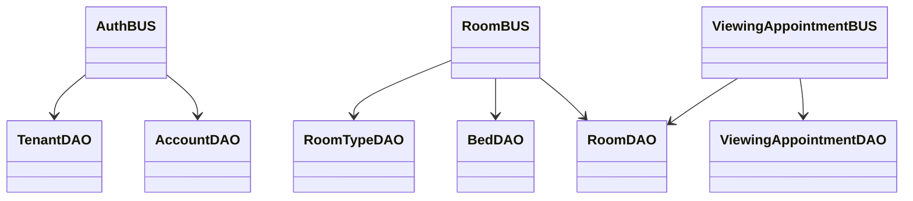

# HomeStay-Dorm — Class Diagram (Simplified)

> 5 chức năng: Đăng ký/Đăng nhập, Trang chủ, Danh sách phòng, Chi tiết phòng + Đặt lịch, Quản lý lịch hẹn
> Ký hiệu: `+` public, `-` private

---

## 1. BUS LAYER (Business Logic)

```mermaid
classDiagram

    class AuthBUS {
        +login(email, password) {token, user}
        +verifyToken(token) JwtPayload
        +getMe(accountId) Account
        +updateProfile(accountId, updates) Account
        +register(data) Account
        +registerCustomer(data) Account
        +forgotPassword(email) {message, otp}
        +resetPassword(email, otp, newPassword) {message}
    }

    class RoomBUS {
        +getAllRooms(filters) {data, pagination}
        +getRoomById(roomId) Room
        +createRoom(roomData) Room
        +addImages(roomId, urls) Room
        +updateRoom(roomId, roomData) Room
        +deleteRoom(roomId) Room
        +getBedsByRoom(roomId) Bed[]
        +getAvailableBedsByRoom(roomId) Bed[]
        +createBed(bedData) Bed
        +deleteBed(bedId) void
        +getAllRoomTypes(filters) {data, pagination}
        +createRoomType(data) RoomType
        +updateRoomType(id, data) RoomType
        +deleteRoomType(id) void
        +getSimilarRooms(roomId) Room[]
        -_formatRoom(room) Room
    }

    class ViewingAppointmentBUS {
        +createViewingAppointment(data) ViewingAppointment
        +getUpcomingAppointments(filters) {data, pagination}
        +confirmAppointment(id) ViewingAppointment
    }
```

---

## 2. DAO LAYER (Data Access)

```mermaid
classDiagram

    class BaseDAO {
        #tableName: string
        #db: SupabaseClient
        +findAll(filters) {data, pagination}
        +findById(id, idColumn, select) Entity
        +create(entity) Entity
        +update(id, updates, idColumn) Entity
        +delete(id, idColumn) Entity
    }

    class AccountDAO {
        +findByEmail(email) Account
        +findByUsername(username) Account
        +findByIdWithRelations(accountId) Account
        +createAccount(data) Account
        +updatePasswordByEmail(email, hash) Account
    }

    class BedDAO {
        +findById(id) Bed
        +update(id, updates) Bed
        +delete(id) Bed
        +findAvailableByRoom(roomId) Bed[]
        +updateStatusMany(bedIds, status) Bed[]
        +updatePricesByRoom(roomId, price) Bed[]
        +createMany(beds) Bed[]
    }

    class BranchDAO { }
    class EmployeeDAO { }
    class RoomDAO {
        +findAvailable(filters) Room[]
        +getMaxRoomNumberForBranch(branchId) number
        +updateAvailableBedCount(roomId) Room
        +findSimilar(roomId, typeId, minPrice, maxPrice) Room[]
    }
    class RoomTypeDAO { }
    class TenantDAO { }
    class ViewingAppointmentDAO {
        +findBySaleEmployee(employeeId) ViewingAppointment[]
        +findUpcoming(filters) ViewingAppointment[]
    }

    AccountDAO --|> BaseDAO
    BedDAO --|> BaseDAO
    BranchDAO --|> BaseDAO
    EmployeeDAO --|> BaseDAO
    RoomDAO --|> BaseDAO
    RoomTypeDAO --|> BaseDAO
    TenantDAO --|> BaseDAO
    ViewingAppointmentDAO --|> BaseDAO
```

---

## 3. DTO LAYER

```mermaid
classDiagram
    class BaseDTO {
        #fields: FieldRule[]
        +validate() {isValid, errors}
    }

    class RoomDTO {
        gender_policy: string
        total_beds: integer
        available_beds: integer
        status: string
        area: string
        room_type_id: integer
        branch_id: integer
        room_description: string
        bed_price: number
        price: number
    }

    RoomDTO --|> BaseDTO
```

---

## 4. BUS → DAO DEPENDENCIES



---

## 5. FRONTEND PAGES

| Route | Page | Chức năng |
|-------|------|-----------|
| `/` | Homepage | Trang chủ |
| `/rooms` | RoomSearch | Danh sách phòng + lọc |
| `/room-detail` | RoomDetail | Chi tiết phòng + đặt lịch |
| `/meet-up` | MeetUpList | Quản lý lịch hẹn |
| `/login` | LoginPage | Đăng nhập |
| `/register` | RegisterPage | Đăng ký |
| `/forget-password` | ForgetPasswordPage | Quên mật khẩu |
